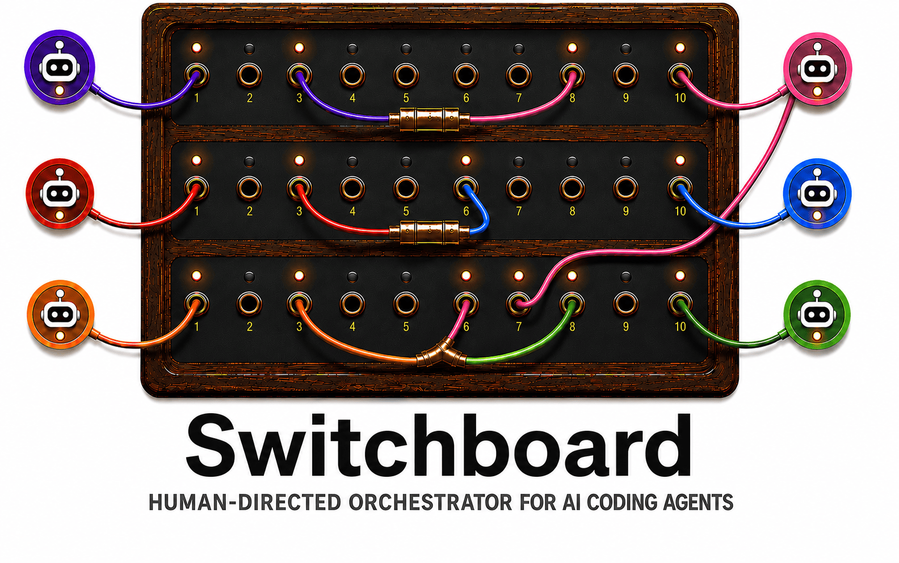

# Switchboard



Switchboard is a human-directed orchestrator for AI coding agents — a desktop application you run alongside your existing Claude Code and Codex setup.

Switchboard lets you spawn multiple Claude Code and Codex sessions in a single project, route messages between them, and define reusable workflows for common multi-agent operations like second-opinion code review, plan-and-implement, and parallel-solution adjudication.

It's built for anyone who wants explicit, human-in-the-loop control over multi-agent workflows — not an opinionated SDLC engine, not a full agent replacement, just the coordination layer between agents you're already using.

## Why

Running multiple AI coding agents in parallel — one to plan, others to review, one to implement — produces meaningfully better results than running a single agent, but the manual coordination overhead (copy-paste between terminals, tracking which agent has which context, applying prompt templates by hand) is busywork that should be automated so you can spend that time on the parts that need judgment.

Switchboard removes the coordination overhead while keeping the human in the loop where judgment matters: deciding what to route, when to revise, when to proceed.

The goal isn't to give the AI a task and review what it produced. It's to stay in the decisions that matter — is this plan good enough to implement? which review feedback is worth acting on? — while automating the mechanical routing in between. Switchboard is the coordination layer; you're still the one making the calls.

There is also a quieter benefit: because Switchboard resolves prompts itself and sends agents plain text, your prompt library lives in one place and works identically with both Claude Code and Codex agents — without configuring the prompt source in either harness. Especially useful for Codex, where MCP prompt support is limited.

## Core ideas

- **Project**: a workspace containing related agents working toward a shared goal (a feature, a refactor, a document).
- **Agent**: a Claude Code or Codex session, named within a project.
- **Workflow**: a reusable, parameterized routing template — for example "fan-out review and aggregate" — defined as a YAML file and invoked by name.
- **Routing**: message passing between agents, optionally wrapped in a prompt template, with support for fan-out (one to many) and fan-in (many to one).

## Non-goals

- Replacing the Claude Code or Codex harness. Switchboard drives them; it doesn't reimplement them.
- Prescribing a software development lifecycle. Workflows are user-defined; Switchboard ships defaults but doesn't impose process.
- Managing git, CI, or PR workflows. Out of scope.
- Cross-session persistent agent memory. Possibly a future addition; not in scope for v1.
- A hosted / SaaS service. Switchboard runs locally on your machine. A future hosted service may exist for cross-machine sync of workflows and prompts; that is not v1.

## Harness support and limitations

Switchboard drives each agent through its own CLI, so it inherits that CLI's capabilities — and a few per-harness limitations are worth knowing up front:

- **Model selection.** Claude Code, Codex, and Gemini let Switchboard choose the model per agent. **Antigravity does not** — its CLI exposes no model option, so Antigravity agents run on whatever model you've selected inside Antigravity itself, and Switchboard can't change it per agent.
- **Codex models depend on your plan.** When you sign in to Codex with a ChatGPT subscription, only the models your plan includes are available; choosing one your plan doesn't cover fails the turn with Codex's own error.
- **Antigravity and hidden folders.** Antigravity can't work in a project whose path contains a hidden (dot-prefixed) folder — for example anything under `~/.config/…`. The agent still runs but can't see your files. Keep projects under normal paths like `~/repos/…`.

## Status

Early development. Design is being captured in [`docs/system-design.md`](./docs/system-design.md).

Switchboard is a Tauri desktop app, macOS only for v1. It's installable today by building from source (see [Install](#install)); a signed Homebrew release (`brew install --cask`) is planned so installs and updates become a single command.

Star or watch the repo if you want to follow along.

## Install

macOS only for v1. Until the signed Homebrew release is available, install by building from source. This is a one-time setup; afterwards `Switchboard.app` lives in `/Applications` like any other app, and updates are a single command.

1. Install the prerequisites (Rust, Node, pnpm, Xcode Command Line Tools) — see [Local development](#local-development) below.
2. Clone, install dependencies, then build and install into `/Applications`:

   ```sh
   git clone https://github.com/shane-kercheval/switchboard
   cd switchboard
   make install   # fetch frontend dependencies
   make deploy    # build, install Switchboard.app to /Applications, and launch
   ```

3. Switchboard is now in `/Applications` — launch it any time from Spotlight or Launchpad.

To update, pull the latest and rebuild:

```sh
git pull && make deploy
```

Because the app is built locally, it carries no quarantine attribute — it launches with no Gatekeeper warning, on first launch and on every update. (`make uninstall-app` removes it.) A signed Homebrew install is planned; this build-from-source path will remain as the zero-dependency, open-source option.

## Design and discussion

The architectural decisions, functional requirements, and open questions are being worked through in [`docs/`](./docs). Comments and pushback welcome via issues.

## Local development

macOS only for v1. Prerequisites:

- **Rust** — pinned via [`rust-toolchain.toml`](./rust-toolchain.toml). Install [rustup](https://rustup.rs); the toolchain will be auto-installed on first build.
- **Node** — version pinned in [`.nvmrc`](./.nvmrc). Install via [nvm](https://github.com/nvm-sh/nvm) (`nvm use`) or any Node version manager.
- **pnpm** — pinned via the `packageManager` field in `package.json`. Enable via `corepack enable` (Corepack ships with Node).
- **Xcode Command Line Tools** — `xcode-select --install` (required for native macOS builds).

Common commands (run from the repo root):

```sh
make install     # one-time: pnpm install --frozen-lockfile
make dev         # run the Tauri dev shell
make test        # run all Rust + frontend tests
make lint        # clippy, eslint, svelte-check
make check       # everything CI runs — run before opening a PR
make test-live   # live-harness suite against real claude/codex (developer-local)
```

`make test-live` exercises the adapters against the real `claude` and `codex`
CLIs to catch upstream drift. See
[`crates/harness/tests/README.md`](./crates/harness/tests/README.md) for what
it covers and how to set it up.

See [`AGENTS.md`](./AGENTS.md) for project orientation and conventions, and [`docs/implementation_plans/`](./docs/implementation_plans/) for the roadmap and per-phase implementation plans.

## Try it out

After `make install`, you can run the UI by launching the Tauri dev shell:

```sh
make dev
```

### Developing without `claude` installed

If `claude` isn't on your `PATH` (or you don't want to burn quota during UI iteration), launch with the mock harness:

```sh
SWITCHBOARD_HARNESS=mock make dev
```

The mock emits canned streaming responses (`Mock response to: <prompt> — replied by mock harness.`) — identical event-stream shape to the real harness, so the UI exercises every code path. The startup binary-not-found banner stays hidden under the mock since `MockHarnessAdapter::probe()` always returns OK.

## License

Apache 2.0. See [LICENSE](./LICENSE).
