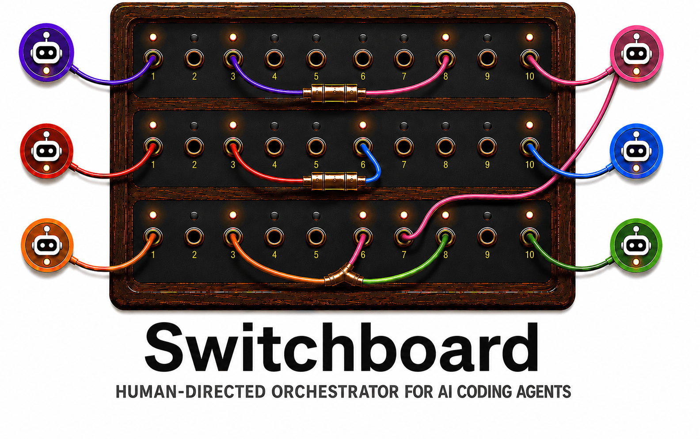
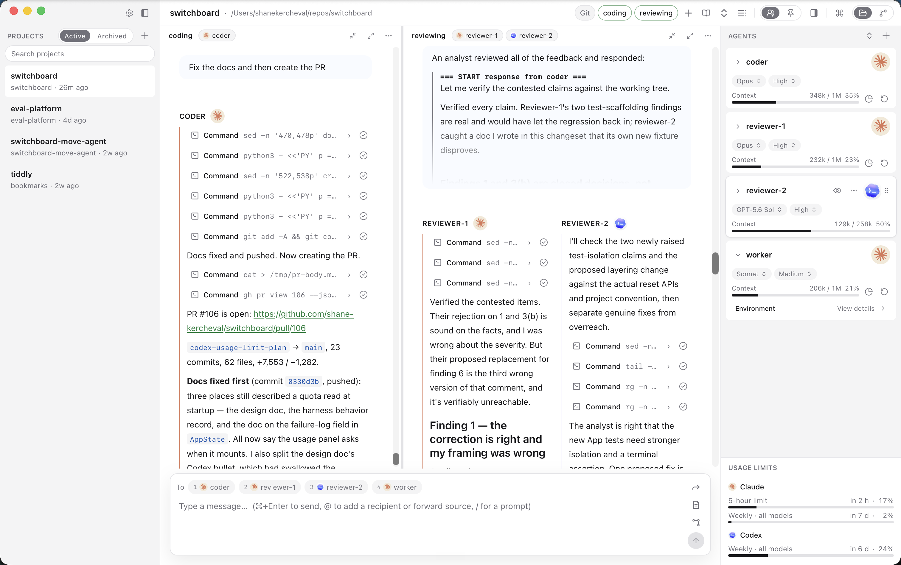
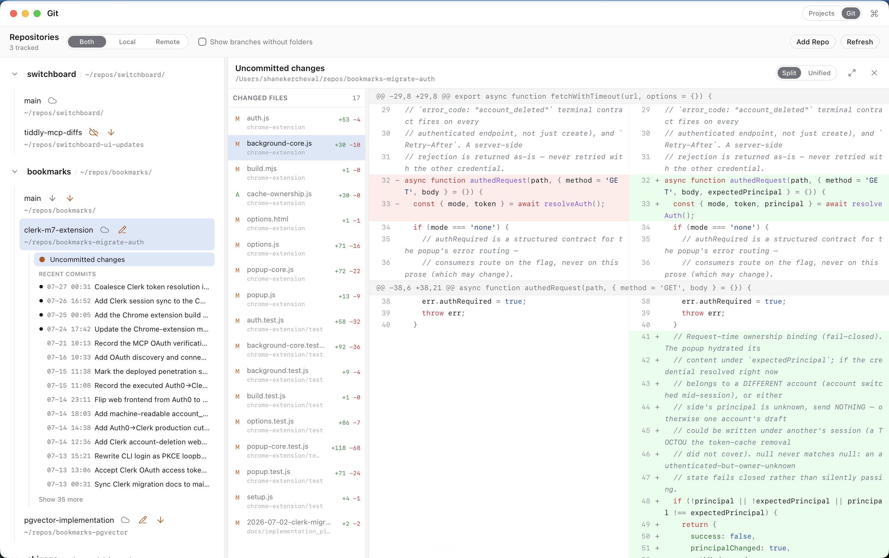
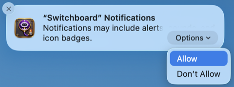

# Switchboard



Switchboard is a human-directed orchestrator for AI coding agents — a desktop app you run alongside your existing CLIs: **Claude Code, Codex, and Antigravity**.

Spawn multiple agent sessions in a single project, route messages between them, and define reusable workflows for common multi-agent operations like second-opinion code review, plan-and-implement, and parallel-solution adjudication.

It's built for anyone who wants explicit, human-in-the-loop control over multi-agent workflows — not an opinionated SDLC engine, not a full agent replacement, just the coordination layer between agents you're already using.



**Projects** are where the work happens. A project holds any number of agents — here one agent implementing while two review its work — and you split the transcript into side-by-side panes to keep each group's conversation readable. You can hide/show and toggle through panes. The compose bar sends the message to whichever agents (or panes) you target, so fanning a message out to every reviewer is one send rather than multiple copy-pastes.



Switchboard also has a **Git view** for reviewing repositories, changed files, diffs, and commit history without leaving the app. It is deliberately read-only: Switchboard does not stage files, create commits, or replace a full Git client.

## Features

- **Work with multiple CLI agents in one project.** Run any combination of the supported Claude Code, Codex, and Antigravity sessions while keeping each agent's conversation and status visible.
- **Fan-out and fan-in.** Send one request to several agents in parallel, then forward one or more responses into the next message — or let a workflow wait for them, combine them, and send the result onward — without copying and pasting between terminals.
- **Fork a conversation.** Create a new agent that inherits the conversation so far, letting you try another approach while leaving the original agent untouched. Available for Claude Code only for now.
- **Group agents into transcript panes.** Keep implementers, reviewers, or other roles together, target the group as one recipient, and hide or solo agents when you need a quieter view.
- **Use one prompt library across your agent CLIs.** Choose parameterized prompts from the built-in library, local files, or HTTP MCP prompt servers; Switchboard centrally resolves and renders them for whichever agents you select.
- **Run reusable multi-agent workflows.** Built-in and user-authored workflows can route prompts, run agents in parallel, wait for their responses, combine the results, and pass them to the next agent.
- **Keep important messages beside the transcript.** Pin complete messages in the sidebar so you can refer to them while working elsewhere, then jump back to their original location when needed.
- **Search and navigate long conversations.** Search message text across agents, filter by role or pinned status, preview results, and jump back to a result when its agent is visible in a pane.
- **Keep track of work across projects.** The project list shows which projects are still running, marks background work when it finishes, and lets you jump directly to newly completed work you haven't viewed.
- **macOS notifications.** Switchboard notifies you when your agents finish and when a workflow run ends, while you're working in another app. Clicking the notification brings Switchboard forward. An optional setting extends this to your other projects while you're still in Switchboard, so a project finishing in the background reaches you while you're reading a different one.
- **Switch between model configurations.** Give an agent a Primary model/effort setup and an optional Secondary setup, then switch between them from its sidebar card without reopening its settings.

## Install

macOS only (v1, early development). Switchboard is currently installed by building from source — a one-time setup, after which it lives in `/Applications` and updates with a single command. A signed Homebrew install is planned.

**1. Clone the repo:**

```sh
git clone https://github.com/shane-kercheval/switchboard
cd switchboard
```

**2. Install the prerequisites** (one-time, run from the repo root). Each is needed to build from source:

- **Xcode Command Line Tools** — `xcode-select --install`
- **Rust** — install [rustup](https://rustup.rs); the pinned toolchain auto-installs on the first build. **After installing, restart your terminal** (or run `source "$HOME/.cargo/env"`) so `cargo` is on your `PATH` — otherwise the build fails with `cargo metadata ... No such file or directory`.
- **Node** — version **22 or newer**. Use whatever you already have, or install one via [nvm](https://github.com/nvm-sh/nvm), [fnm](https://github.com/Schniz/fnm), Homebrew, etc. (You don't need a specific patch version — `make install` checks for the minimum and stops with a clear message if it's too old. Contributors: [`.nvmrc`](./.nvmrc) pins the exact version CI runs, picked up with `nvm use`; that exact pin isn't required just to build the app.)
- **pnpm** — run `corepack enable`. Corepack ships with Node and provides the pnpm version pinned in [`package.json`](./package.json); you do **not** install pnpm separately.

Confirm the toolchain resolves before continuing:

```sh
node --version   # 22 or newer
pnpm --version   # Corepack provides the pinned version on first pnpm call
```

**3. Build, install, and launch:**

```sh
make install   # install JS dependencies (pnpm install --frozen-lockfile)
make deploy    # build, install to /Applications, and launch
```

Update with `git pull && make deploy`; remove with `make uninstall-app`.

## Why

Running multiple AI coding agents in parallel — one to plan, others to review, one to implement — produces meaningfully better results than running a single agent, but the manual coordination overhead (copy-paste between terminals, tracking which agent has which context, applying prompt templates by hand) is busywork that should be automated so you can spend that time on the parts that need judgment.

Switchboard removes the coordination overhead while keeping the human in the loop where judgment matters: deciding what to route, when to revise, when to proceed.

The goal isn't to give the AI a task and review what it produced. It's to stay in the decisions that matter — is this plan good enough to implement? which review feedback is worth acting on? — while automating the mechanical routing in between. Switchboard is the coordination layer; you're still the one making the calls.

## Coordinating agents

A fan-out sends one instruction to several agents so they can work independently — for example, asking multiple reviewers to assess the same plan or diff. A fan-in brings their work back together: select one or more agent responses as sources for a new message, or use a workflow to wait for every reviewer, combine their responses, and pass the result to another agent.

Forwarding uses the agents' actual responses and clearly labels each source for the recipient. If a selected agent is still working, Switchboard holds the dependent message until the response is ready. You can add your own instructions or apply a prompt while forwarding, so the handoff can say what the next agent should do with the supplied material rather than merely pasting it into a new terminal.

Fork creates a new Claude Code agent from an existing conversation. With one Claude agent selected, use the Fork half of the send button to send your message to `<name>-fork`, which inherits the conversation so far while leaving the original untouched. Use it to explore another approach from the same starting point.

Model profiles let an agent keep a Primary model/effort setup and an optional Secondary setup you can switch to from its sidebar card. Per-agent-type defaults in Settings prefill Add Agent and are applied automatically when a new project creates its starting agents.

Panes make that routing easy to see. You can keep agents with related roles together and address the pane as a group, while every agent remains an independent session that can also be targeted directly.

## Prompts and workflows

Prompts are reusable, optionally parameterized text templates. They can come from Switchboard's built-in library, local files, or an HTTP MCP prompt server. The compose bar presents the prompt's arguments as fields, lets you preview the rendered result, and centrally resolves the same template for every supported agent CLI. Your prompt library therefore needs to be configured only once, including for CLIs with limited native MCP prompt support.

Add an HTTP MCP prompt server under Settings → **Add MCP server**, choosing one of two authentication modes. **OAuth sign-in** opens your browser to sign in with the server's own account system — nothing to paste; this requires the server to support OAuth dynamic client registration, and it needs a browser, so it isn't for headless machines. [Tiddly](https://tiddly.me) works this way: add `https://prompts-mcp.tiddly.me/mcp`, then click Sign in on its row. **Bearer token** is the path for servers without OAuth support and for headless or scripted use — paste a token minted by the server (for Tiddly, a Personal Access Token); tokens are stored in your OS keychain. Stdio MCP servers are planned but not currently supported.

Switchboard stores all of its MCP prompt-provider credentials in one Keychain item. Upgrading from the older per-provider format requires one-time reauthentication: sign in to OAuth providers again, and remove/re-add bearer providers to paste their tokens again. After the new credentials work, you may delete the obsolete per-provider Switchboard entries in Keychain Access. An unchanged app then restarts without another prompt; a newly rebuilt ad-hoc app asks once total after you choose **Always Allow**, regardless of provider count. Build-from-source approvals can recur after another rebuild until stable Developer ID signing is delivered.

Workflows record routing patterns you otherwise repeat by hand: send a prompt to several agents, wait for them, aggregate their responses, and hand the result to the next agent. Switchboard includes built-in workflows, and you can copy or write personal YAML workflows that are available in every project on this Mac. The invocation form shows what a workflow will do and lets you bind its agent roles; while it runs, the compose area shows the current step and what remains.

## Transcripts, search, and pins

Switchboard combines each project's agent sessions into one chronological transcript while preserving agent attribution, tool calls, reasoning, failures, cancellations, and context-compaction boundaries. Compact mode keeps routine detail out of the way without removing it from the history.

Press ⌘F to search message text across the project, filter by role or pinned status, and preview a result before jumping to it. Selecting a result whose agent is visible in a pane reveals that pane, scrolls to the message, and expands it when necessary. Messages from eye-hidden or unassigned agents remain searchable but cannot be jumped to until the agent is visible in a pane.

Pins are for messages you need to keep reading, not just bookmarks. A pinned message appears in full in the sidebar, where it can remain visible while you work elsewhere in the transcript. Jumping from a pin scrolls the transcript to the original message. Pins can also be added or filtered from search.

## Transcript panes

By default a project shows one unified transcript of all its agents. You can split it into side-by-side panes — for example reviewers on the left, the implementer on the right — where each pane shows only its agents' conversation.

- **Create and populate a pane**: click the **+** button in the project header to add an empty pane, then use an agent's **⋯ actions menu** to move it into that pane. **Move to new pane** creates and populates one in a single action. On the first split from the default unified view, if the compose bar targets only a subset of agents, the original pane keeps that subset and the other agents become unassigned; otherwise its membership stays unchanged.
- **Send to a pane**: click a pane's header (or ⌘-click anywhere in it, type `@panename` in the composer, or press ⌘⌥1–9) to make that pane's agents the message recipients. The targeted pane shows a green ring — your draft goes exactly to the agents inside it. Hold ⌘ to preview which pane a click would target.
- **Rename / resize / close**: panes rename from the pencil icon in their header and resize by dragging the divider between them. Closing a pane leaves its agents unassigned and stops targeting them, but the agents keep working. Choose **Return to unified view** from a pane's menu to show every agent together again.
- **Hide agents**: the eye icon on an agent's sidebar card hides its messages without removing it (⌥-click to solo it — show only that agent in its pane). Hidden agents still receive messages you send them; the recipient chip shows a warning when you're about to message a hidden agent.

The layout (panes, names, widths, hidden agents) is remembered per project on this machine.

## Non-goals

- Replacing the agent CLIs. Switchboard drives them; it doesn't reimplement them.
- Prescribing a software development lifecycle. Workflows are user-defined; Switchboard ships defaults but doesn't impose process.
- Managing git, CI, or PR workflows. Out of scope.
- Cross-session persistent agent memory. Possibly a future addition; not in scope for v1.
- A hosted / SaaS service. Switchboard runs locally on your machine. A future hosted service may exist for cross-machine sync of workflows and prompts; that is not v1.

## Upgrading from a pre-store version

Switchboard used to keep each project's state inside your working directory, in a `.switchboard/` folder. It now keeps everything in one place under `~/Library/Application Support/switchboard/`, so deleting or moving a checkout no longer takes its conversation history with it.

If you used Switchboard before that change, your old projects will not appear until you migrate them. Nothing is lost in the meantime — the old folders are untouched. Run, from a checkout:

```
cargo run -p switchboard-migrate
```

It reads the directory list from your existing configuration, copies each directory's projects into the new location, and prints a report. **It never modifies or deletes your originals**, so if the result looks wrong you can delete the new store and run it again. Directories that are unavailable (a deleted worktree, an unplugged disk) are reported and skipped.

Run it **before** launching the new version, which rewrites the configuration file the tool reads.

## Agent CLI support and limitations

Switchboard drives each agent through its own CLI, so it inherits that CLI's capabilities — and a few CLI-specific limitations are worth knowing up front:

- **Model profiles.** Every agent — Claude Code, Codex, and Antigravity — can have a Primary model/effort setup plus an optional Secondary setup for quick switching. Set per-agent-type defaults in Settings; Add Agent and new projects use them automatically. The transcript records the model each past turn actually ran on.
- **Reasoning effort.** Every supported agent CLI lets Switchboard set the reasoning-effort level per agent (alongside the model). **Antigravity's effort options depend on the model you pick,** and some of its models have no effort setting at all — the picker only offers the levels that model accepts, and hides the control entirely for models that don't have one.
- **Codex models depend on your plan.** When you sign in to Codex with a ChatGPT subscription, only the models your plan includes are available; choosing one your plan doesn't cover fails the turn with Codex's own error.
- **The highest Codex effort levels need a GPT-5.6 model.** The `Max` and `Ultra` reasoning-effort levels work on the GPT-5.6 family (Sol, Terra, Luna); older models such as GPT-5.5 top out at `XHigh`. Selecting a higher level on an older model fails the turn with Codex's own message listing the levels that model supports — switch the model or lower the effort and resend.
- **Gemini is no longer supported.** Google withdrew Gemini CLI access for individual accounts, which left it impossible to test or use here, so support was removed. Use Antigravity — Google's replacement for individual plans — instead.
- **Antigravity forgets failed tool calls when you reopen a conversation.** While an Antigravity agent is running you'll see a tool that failed along with Antigravity's reason for it. If you close the project and reopen it later, that tool still appears but its result reads "Antigravity did not record a result for this tool call." Antigravity writes nothing to its own transcript file for a rejected tool call, so the reason genuinely isn't there to recover. Nothing else about the conversation is affected.
- **Some messages can't be pinned.** Switchboard disables Pin when a message has no identity that survives reopening rather than risk attaching the pin to a different message. This includes some imported history and every Antigravity reply. User messages sent through Switchboard can still be pinned.
- **Picking up terminal-continued sessions.** If you continue a session in the agent CLI's own terminal, **Claude Code** picks up the new turns when you switch back to the project. **Codex and Antigravity don't yet** — reopen Switchboard to load their updated history.
- **An existing conversation can only have one turn running at a time, across everything Switchboard runs.** Two situations reach this. If you run a development build alongside the installed app, both see the same agent CLI conversations — those files belong to the CLI, not to Switchboard — and sending from both at once would leave one agent's answer missing from the other's record. And while Fork is creating a branch, that branch's first turn is still reading the original agent's conversation, so the original can't start a turn until the branch's first turn finishes (the reverse was already true: you can't branch from an agent that's mid-turn). Either way the second send is refused with "this conversation is already in use by a running turn" — wait for that turn to finish and resend. This guards Switchboard against itself only: a conversation you're also driving from a terminal, or from another tool, is outside what it can see. A brand-new conversation — an agent's very first message on Codex or Antigravity — has nothing to conflict with yet, so it is never held up.
- **Fork is currently Claude Code only.** The Fork half of the send button (⇧⌘↵) appears when one idle Claude Code agent with an existing session is selected. It creates a new agent with the conversation so far and sends your message as its first turn. Claude is the only CLI path Switchboard currently uses that can create a lossless child session during a send, so Fork is unavailable for other agents and multi-agent sends.

## Notifications

A turn can run for a long time, and the point of running several agents at once is that you go and do something else while they work. Switchboard posts a macOS notification when a message you sent has been answered by every agent it went to, and when a workflow run reaches its end. The notification names the project and the agents involved, so it tells you where to go back to. Clicking it brings Switchboard forward.

Which notifications reach you depends on where you are. When Switchboard isn't the app you're using, everything notifies. When it is, the project on screen stays quiet, because its transcript is already telling you. Your other projects stay quiet too by default; the projects sidebar marks them as finished instead. Turn on the second setting in Settings → Notifications if you'd rather be interrupted than notice the marker later.

The first time it needs to notify you, macOS asks for permission. **The Allow button is behind the "Options" dropdown** — the prompt is easy to dismiss without noticing it:

<!-- Sized in HTML, not scaled down on disk: the capture is 2x, so rendering it at
     half its pixel width keeps it crisp on a Retina display. -->


If you miss it, Settings → Notifications tells you macOS is blocking notifications and where to turn them back on (System Settings → Notifications → Applications → Switchboard).

## Design and discussion

The architectural decisions, functional requirements, and open questions are being worked through in [`docs/`](./docs), starting with [`docs/system-design.md`](./docs/system-design.md). Comments and pushback welcome via issues.

## Local development

macOS only for v1. The build prerequisites are the same as [Install](#install) above — Xcode Command Line Tools, Rust (rustup), Node (pinned in [`.nvmrc`](./.nvmrc)), and pnpm (`corepack enable`). If you've installed the app, you already have everything.

Common commands (run from the repo root):

```sh
make install     # one-time: pnpm install --frozen-lockfile
make dev         # run the Tauri dev shell
make test         # run all Rust + frontend tests (fast, offline jsdom suite)
make test-browser # real-WebKit frontend suite (Vitest browser mode); installs WebKit if needed
make lint         # clippy, eslint, svelte-check
make check        # everything CI runs (incl. the browser suite) — run before opening a PR
make test-live    # live-harness suite against the real agent CLIs (developer-local)
```

`make test-live` exercises the adapters against the real `claude` / `codex` / `antigravity` CLIs to catch upstream drift. See [`crates/harness/tests/README.md`](./crates/harness/tests/README.md) for what it covers and how to set it up.

`make test-browser` (and `make check`) run the frontend suite in a real WebKit engine via Vitest browser mode. The target installs a Playwright-managed WebKit build on demand — the first run downloads ~100 MB (cached afterward), so it needs network access once; no extra system packages are required on macOS. The default `make test` stays jsdom-only and needs none of this.

See [`AGENTS.md`](./AGENTS.md) for project orientation and conventions, and [`docs/implementation_plans/`](./docs/implementation_plans/) for the roadmap and per-phase implementation plans.

### Developing without an agent CLI installed

If no agent CLI is on your `PATH` (or you don't want to burn quota during UI iteration), launch with the mock harness:

```sh
SWITCHBOARD_HARNESS=mock make dev
```

The mock emits canned streaming responses (`Mock response to: <prompt> — replied by mock harness.`) — identical event-stream shape to a real harness, so the UI exercises every code path, and the startup binary-not-found banner stays hidden.

## License

Apache 2.0. See [LICENSE](./LICENSE).
